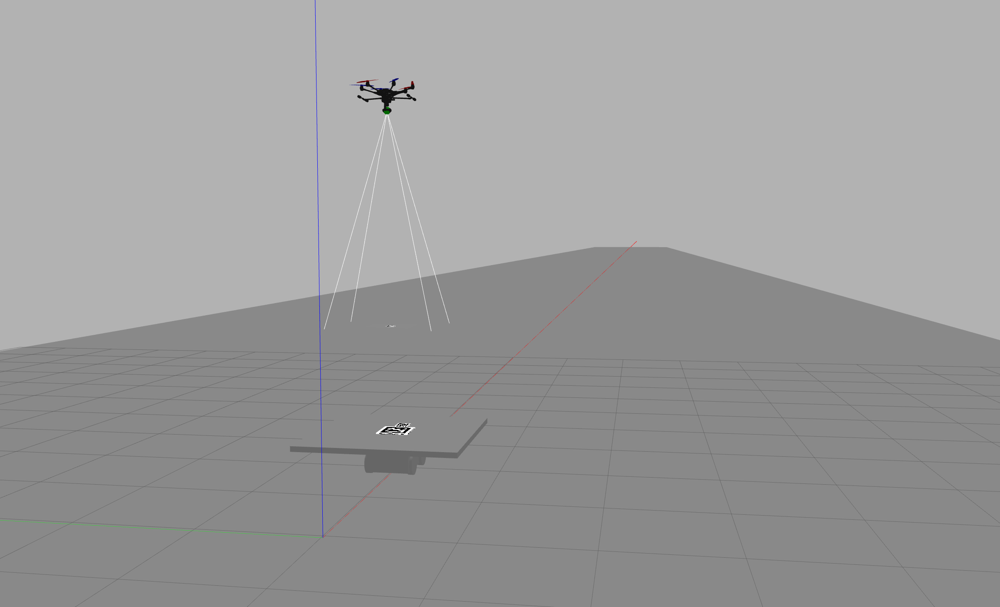

# landing_simulation

## Simulation





## How to use

1. clone the repositories in the your_workspace/src/.
```
git clone https://github.com/bwh1270/landing_simulation.git
git clone https://github.com/koide3/gazebo_apriltag.git
```
All of ApriltTag .png files is collected in https://github.com/AprilRobotics/apriltag-imgs.git.

2.  Move the AprilTags to gazebo model directory.
```
cd landing_simulation/start/
chmod +x mv_tags.sh   # or sudo chmod +x mv_tags.sh
./mv_tags.sh
```
3. Build the landing_simulation package
```
catkin build 
```
4. Possible commands
```
roslaunch landing_simulation autonomous_landing.launch
rosrun landing_simulation ugv_vc_node
rosrun landing_simultion setpoint_publisher_node
rosrun landing_simulation recordData
```

## Node Descriptions
- SetpointPublisher - publishes the reference signal of velocity to UAV. I used only for velocity gains tuning.
- UGVVelocityControl - publishes the reference signal of velocity to UGV. 
- recordData - records UAV and UGV data and saves them.
- AprilTagDetection - subscribes the output of apriltag_ros and publishes the relative position and velocity of UGV with respect to UAV in inertia frame.
- LinearKalmanFilter - subscribes the output of AprilTagDetection node and publishes the state estimate.
- PositionControl - subscribes the state estimate or ground truth of UGV by /odom  and publishes the control input of velocity command to UAV.
